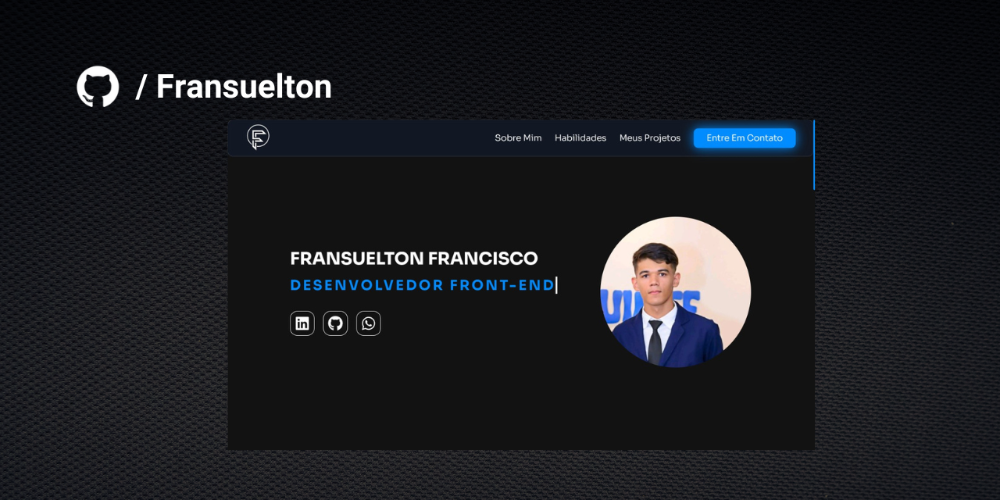

<br/>
<p align="center">
    
  </a>

  <h1 align="center">Portfólio</h1>

  <p align="center">
    Este é o meu primeiro portfólio, desenvolvido de forma independente. Aqui, apresento alguns dos meus projetos e disponibilizo informações sobre mim, bem como uma seção para contato.
    <br/>
    <br/>
    <a href="https://github.com/Fransuelton/meu-portfolio"><strong>Explore os arquivos »</strong></a>
    <br/>
    <br/>
    <a href="https://meu-portfolio-gamma-ten.vercel.app/">Ver Projeto</a>
    .
    <a href="https://github.com/Fransuelton/meu-portfolio/issues">Reportar Bug</a>
  </p>
</p>

## Índice

- [Índice](#índice)
- [📺 Demonstração do Projeto](#-demonstração-do-projeto)
- [💻 Tecnologias Utilizadas](#-tecnologias-utilizadas)
- [▶️ Rodando o Projeto](#️-rodando-o-projeto)
- [📜 Licença](#-licença)
- [🧑‍💻 Autores e Créditos](#-autores-e-créditos)

## 📺 Demonstração do Projeto


## 💻 Tecnologias Utilizadas

Neste projeto, utilizei as seguintes tecnologias e ferramentas:

* **React**: Base para a estrutura do projeto.
* **Styled Components**: Para estilização de componentes.
* **Font Awesome**: Criação de ícones.
* **Swiper JS**: Slider de projetos.
* **AOS - Animate on Scroll**: Transições suaves ao rolar a página.
* **Formspree**: Integração do formulário de contato sem banco de dados.

## ▶️ Rodando o Projeto

```bash
# Clone este repositório utilizando HTTPS OU SSH
$ git clone https://github.com/Fransuelton/meu-portfolio.git

$ git clone git@github.com:Fransuelton/meu-portfolio.git

# Acesse a pasta do projeto no terminal
$ cd meu-portfolio

# Instale as dependências
$ npm install

# Execute a aplicação em modo de desenvolvimento
$ npm run dev
```

## 📜 Licença

Distribuído sob a Licença MIT. Consulte [LICENSE](https://github.com/Fransuelton/meu-portfolio/blob/main/LICENSE) para obter mais informações.

## 🧑‍💻 Autores e Créditos
  
* **Fransuelton** - *Desenvolvedor Front-end* - [Fransuelton](https://www.linkedin.com/in/fransuelton/) - *Criador do Projeto e Design*

* **Shaan Khan** - *Comp Sci Student* - [Shaan Khan](https://github.com/ShaanCoding/) - *Criador desse Template de README*

* **Skill Icons** - [Skill Icons](https://skillicons.dev/) - *Ícones utilizados na seção de habilidades*
